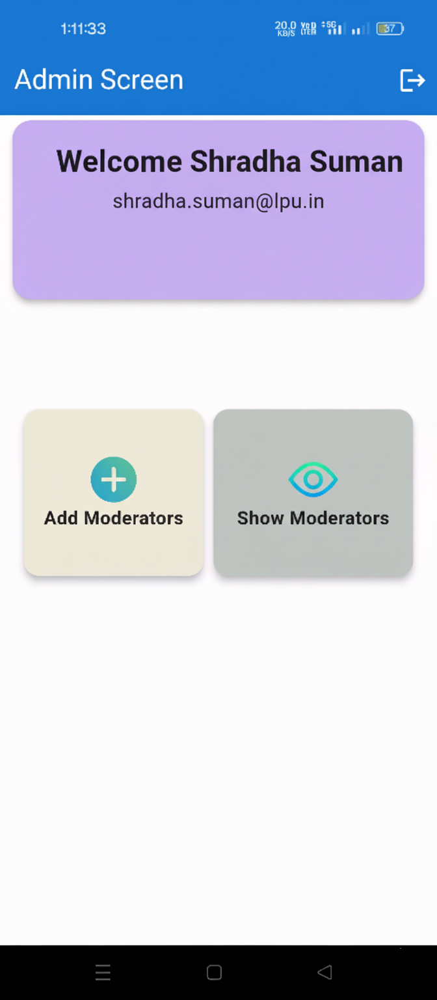
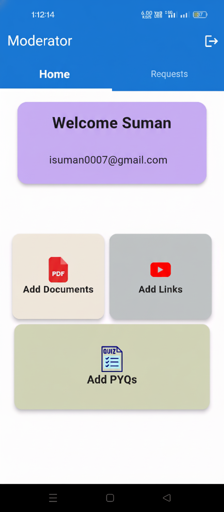
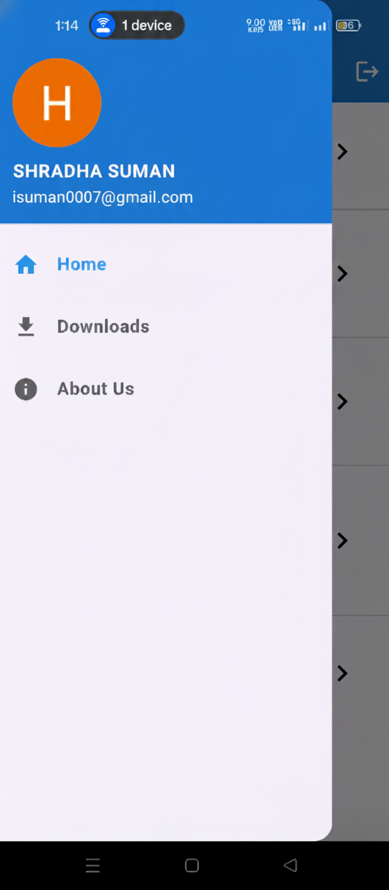

# GradePlus App

Welcome to the GradePlus App! This app is designed to provide LPU students with access to lecture PDFs, previous year papers, study materials, and a chat feature for each subject. Students can also submit their own materials for moderation and inclusion in the database.

## Features

- **Lecture PDFs**: Access and download lecture notes.
- **Previous Year Papers**: Browse and download past exam papers.
- **Study Materials**: Find links to additional study resources like YouTube videos and Google Drive files.
- **Subject Chat**: Participate in subject-specific chats to discuss and collaborate with classmates.
- **Material Submission**: Submit study materials for verification and inclusion in the app.


## Screenshots

### Login Screen


### Admin Screen
- **Admin Dashboard**: Manage moderators and content.
  

### Moderator Screen
- **Moderator Dashboard**: Review and approve submitted materials.
  

### User Screen
- **Home Screen**: Access and download lecture notes, past papers, and other study resources.
  
  
- **Subject Screen**: 
  

  
- **Side Navigation**: 
  

## Tech Stack

- **Languages**: Dart
- **Framework**: Flutter
- **Backend**: Firebase (for authentication, real-time database)
- **Database**: Firestore
- **Tools**: Android Studio


## Getting Started

Follow these instructions to set up the project locally on your machine.

### Prerequisites

- Flutter SDK: [Install Flutter](https://flutter.dev/docs/get-started/install)
- Android Studio or Visual Studio Code for development

### Installation

### Installation

1.  **Clone the repository:**
    ```bash
    git clone [https://github.com/himanshuhr8/GradePlus.git](https://github.com/himanshuhr8/GradePlus.git)
    cd GradePlus
    ```

2.  **Install dependencies:**
    Run the following command in the project's root directory to download all the necessary packages.
    ```bash
    flutter pub get
    ```

3.  **Set up Firebase:**
    This project uses Firebase for authentication and database. You must create your own Firebase project to run it.

    * Go to the [Firebase Console](https://console.firebase.google.com/) and create a new project.
    * **For Android:**
        1.  In your Firebase project, add a new Android app.
        2.  You will be asked for a package name. You can find this in your project files at `android/app/build.gradle` (look for the `applicationId` value).
        3.  Register the app, download the `google-services.json` file.
        4.  Place this `google-services.json` file inside the `android/app/` directory of your Flutter project.
    * **For iOS (Optional):**
        1.  In your Firebase project, add a new iOS app.
        2.  You will be asked for an iOS bundle ID.
        3.  Register the app, download the `GoogleService-Info.plist` file.
        4.  Open the `ios` folder in your project with Xcode, and drag this file into the `Runner` folder.

4.  **Run the app:**
    Make sure you have an emulator running or a physical device connected, then run:
    ```bash
    flutter run
    ```
